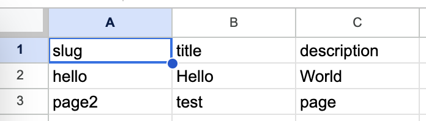

# Static generator from CSV to HTML Prototype from Google Sheets

This is a prototype static generator from CSV to HTML.



## Usage

```bash
$ go run main.go --url "https://docs.google.com/spreadsheets/d/e/2PACX-1vS2G07wmughoVtxVIODRUNxsOzqwnrOyGQlXD-S7TLTp-vi7AtGkh8AxlTLsUh-KIwrvdjrRUMK0Qrj/pub?gid=0&single=true&output=csv" --template "template.html" --dist "dist"
```

## Options

* `--url` The URL of the CSV file.
* `--template` The path to the HTML template file.
* `--dist` The path to the output directory.
